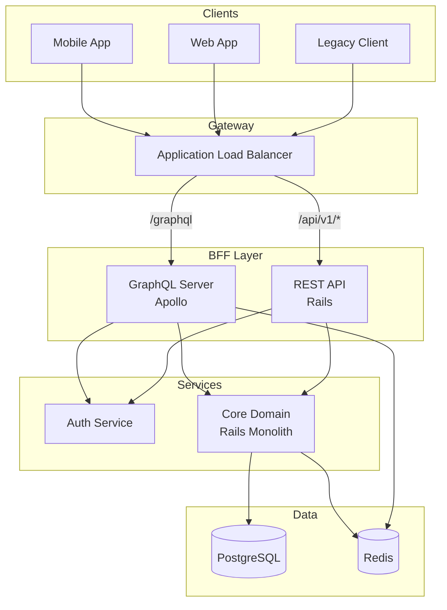

# API Design Example

## Issue
「モバイルアプリとWebアプリに統一APIを提供しつつ、将来のマイクロサービス分割に備えられるか」

## Context
```yaml
current_state:
  - モノリシックRailsアプリ（3年運用）
  - 20エンドポイント、日間100万リクエスト
  - レスポンス時間: 平均200ms、P99 800ms
constraints:
  - 既存モバイルアプリの後方互換性維持
  - チーム: バックエンド3名
  - 3ヶ月でMVP
available:
  - AWS (ECS, ALB, API Gateway)
  - PostgreSQL (RDS)
  - Redis (ElastiCache)
goal:
  outcome: REST APIとGraphQLの両方を提供
  metrics:
    - P99レイテンシ < 300ms
    - 後方互換性100%
    - 開発者体験向上（API変更時の影響範囲明確化）
hypothesis: |
  BFF (Backend for Frontend) パターンで GraphQL を導入し、
  既存 REST は維持しつつ段階的に移行できる
concerns:
  - N+1問題
  - GraphQLの学習コスト
  - 認証・認可の複雑化
```

## Design Decision

### Main Thesis
GraphQL BFFを新規構築し、既存RESTエンドポイントと並行運用。モバイル向けにはGraphQL、レガシークライアント向けにはRESTを維持する。

### Sub-thesis 1: GraphQL BFFの妥当性
**Claim**: モバイルアプリの通信効率をGraphQLで50%改善できる
**Evidence**:
- Over-fetching削減: 必要なフィールドのみ取得
- Under-fetching削減: 複数リソースを1リクエストで取得
- Netflix, GitHub, Shopifyの導入事例
- 参照: https://graphql.org/learn/
**Implication**: モバイルアプリのAPIコール数を1/3に削減

### Sub-thesis 2: N+1問題の解決
**Claim**: DataLoaderパターンで N+1 を防止できる
**Evidence**:
- DataLoader: バッチ処理でDB呼び出しを最適化
- 参照: https://github.com/graphql/dataloader
**Implication**: クエリ複雑度に関わらず一定の性能を担保

### Sub-thesis 3: 認証・認可の統一
**Claim**: JWT + Directive-based認可で既存システムと統合できる
**Evidence**:
- GraphQL Directives: フィールドレベルの認可制御
- 既存JWTトークンの再利用可能
**Implication**: 認証基盤の変更なしに移行可能

## Architecture



## Implementation

### Critical Path
1. **[Blocker]** GraphQL スキーマ設計とRESTとのマッピング定義
2. **[Architectural]** DataLoader実装とN+1検証
3. **[Integration]** 既存認証基盤との統合
4. **[Implementation]** エンドポイントの段階的移行

### Code Example: GraphQL Schema

```graphql
# schema.graphql
type Query {
  me: User @auth
  user(id: ID!): User @auth
  users(first: Int, after: String): UserConnection @auth(role: ADMIN)
  orders(status: OrderStatus): [Order!]! @auth
}

type Mutation {
  createOrder(input: CreateOrderInput!): CreateOrderPayload @auth
  updateUser(input: UpdateUserInput!): UpdateUserPayload @auth
}

type User {
  id: ID!
  email: String!
  name: String!
  orders(first: Int): [Order!]!
  createdAt: DateTime!
}

type Order {
  id: ID!
  status: OrderStatus!
  items: [OrderItem!]!
  user: User!
  total: Money!
  createdAt: DateTime!
}

# Directive for authorization
directive @auth(role: Role = USER) on FIELD_DEFINITION

enum Role {
  USER
  ADMIN
}
```

### Code Example: DataLoader Implementation

```typescript
// dataloaders.ts
import DataLoader from 'dataloader';
import { User, Order } from './models';

export const createLoaders = () => ({
  userLoader: new DataLoader<string, User>(async (ids) => {
    const users = await User.findByIds(ids);
    const userMap = new Map(users.map(u => [u.id, u]));
    return ids.map(id => userMap.get(id) ?? null);
  }),
  
  ordersByUserLoader: new DataLoader<string, Order[]>(async (userIds) => {
    const orders = await Order.findByUserIds(userIds);
    const orderMap = new Map<string, Order[]>();
    
    orders.forEach(order => {
      const existing = orderMap.get(order.userId) || [];
      orderMap.set(order.userId, [...existing, order]);
    });
    
    return userIds.map(id => orderMap.get(id) ?? []);
  }),
});

// resolvers.ts
const resolvers = {
  Query: {
    me: (_, __, { user }) => user,
    user: (_, { id }, { loaders }) => loaders.userLoader.load(id),
  },
  User: {
    orders: (user, _, { loaders }) => loaders.ordersByUserLoader.load(user.id),
  },
  Order: {
    user: (order, _, { loaders }) => loaders.userLoader.load(order.userId),
  },
};
```

### Code Example: Auth Directive

```typescript
// auth-directive.ts
import { mapSchema, getDirective, MapperKind } from '@graphql-tools/utils';
import { defaultFieldResolver, GraphQLSchema } from 'graphql';

export function authDirectiveTransformer(schema: GraphQLSchema) {
  return mapSchema(schema, {
    [MapperKind.OBJECT_FIELD]: (fieldConfig) => {
      const authDirective = getDirective(schema, fieldConfig, 'auth')?.[0];
      
      if (authDirective) {
        const { resolve = defaultFieldResolver } = fieldConfig;
        const requiredRole = authDirective['role'] || 'USER';
        
        fieldConfig.resolve = async (source, args, context, info) => {
          if (!context.user) {
            throw new AuthenticationError('Not authenticated');
          }
          
          if (requiredRole === 'ADMIN' && !context.user.isAdmin) {
            throw new ForbiddenError('Admin access required');
          }
          
          return resolve(source, args, context, info);
        };
      }
      
      return fieldConfig;
    },
  });
}
```

## Defensive Review

### Risk Matrix
| Risk | Impact | Probability | Mitigation |
|------|--------|-------------|------------|
| N+1クエリによる性能劣化 | High | Medium | DataLoader必須、クエリ複雑度制限 |
| 深いネストによるDoS | High | Low | Depth Limit (10)、Cost Analysis |
| スキーマ変更の後方互換性破壊 | Medium | Medium | Deprecation policy、Schema Registry |
| 認可漏れ | Critical | Low | Directive必須化、セキュリティレビュー |

### Security Considerations

```typescript
// Query complexity limiting
import { createComplexityLimitRule } from 'graphql-validation-complexity';

const complexityLimit = createComplexityLimitRule(1000, {
  onCost: (cost) => console.log('Query cost:', cost),
  formatErrorMessage: (cost) => 
    `Query too complex: ${cost}. Maximum allowed: 1000`,
});

// Depth limiting
import depthLimit from 'graphql-depth-limit';

const server = new ApolloServer({
  schema,
  validationRules: [
    depthLimit(10),
    complexityLimit,
  ],
});
```

### Failure Modes
1. **BFFダウン**: ALBヘルスチェック + 自動復旧、RESTにフォールバック
2. **DataLoader障害**: 個別フェッチにフォールバック（性能劣化は許容）
3. **認証基盤障害**: キャッシュされたJWT検証で一時的に継続

## Test Plan

### Unit Tests
- Resolver単体テスト（モック使用）
- DataLoaderのバッチング検証
- Auth Directiveの認可ロジック

### Integration Tests
- GraphQL → Core Domain のE2Eフロー
- 認証トークン検証フロー
- エラーハンドリング（認証失敗、認可失敗、バリデーションエラー）

### Performance Tests
- 同時1000リクエストでのP99レイテンシ
- 深いネストクエリでの応答時間
- DataLoaderのバッチ効率

### Acceptance Criteria
- [ ] 既存RESTエンドポイントと同等の機能をGraphQLで提供
- [ ] P99レイテンシ < 300ms
- [ ] N+1クエリが発生しないことを検証
- [ ] 認証・認可が全エンドポイントで機能

## Migration Plan

### Phase 1: 基盤構築（2週間）
- GraphQLサーバー構築
- 認証基盤統合
- DataLoader実装

### Phase 2: コアエンドポイント移行（4週間）
- User関連API
- Order関連API
- 並行運用開始

### Phase 3: 完全移行（4週間）
- 残りのエンドポイント移行
- モバイルアプリのGraphQL対応
- RESTのDeprecation告知

## References
- GraphQL Best Practices: https://graphql.org/learn/best-practices/
- Apollo Server: https://www.apollographql.com/docs/apollo-server/
- DataLoader: https://github.com/graphql/dataloader
- GraphQL Security: https://cheatsheetseries.owasp.org/cheatsheets/GraphQL_Cheat_Sheet.html
