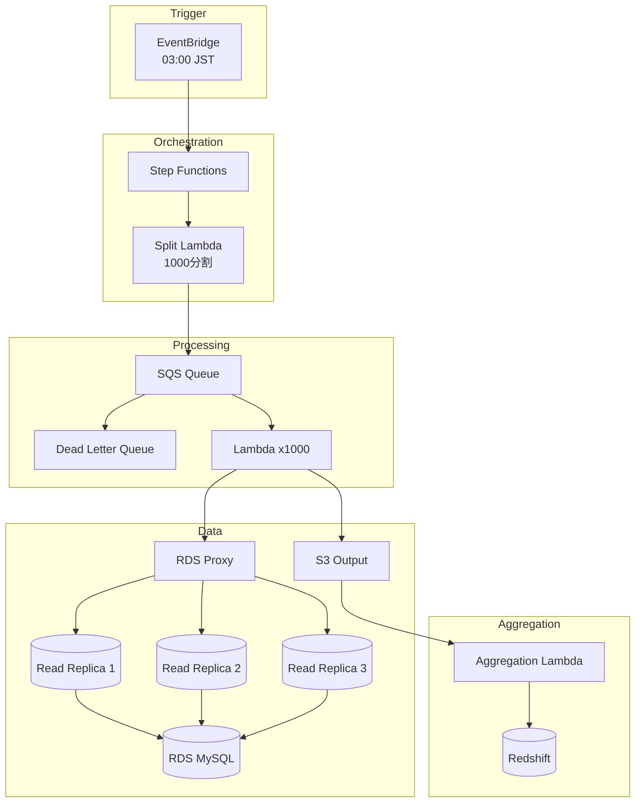

# Batch Processing System Design Example

## Issue
「日次で1000万件のトランザクションを3時間以内に処理し、レポートを生成できるか」

## Context
```yaml
current_state:
  - 現行システムは単一サーバーで8時間かかっている
  - データソースはRDS MySQL (5TB)
  - 出力はS3 + Redshift
constraints:
  - 処理ウィンドウ: 03:00-06:00 JST
  - 予算: $3000/月以下
  - チーム: バックエンド2名、インフラ1名
available:
  - AWS (ECS, Lambda, Step Functions, SQS, S3)
  - Terraform for IaC
goal:
  outcome: 営業開始前にレポート閲覧可能
  metrics:
    - 処理時間 < 3時間
    - エラー率 < 0.01%
    - リトライ成功率 > 99%
hypothesis: |
  SQS + Lambda の Fan-out パターンで並列化すれば、
  処理時間を1/10に短縮できる
concerns:
  - Lambda の同時実行制限
  - RDS への読み取り負荷
  - 部分失敗時のデータ整合性
```

## Design Decision

### Main Thesis
SQS + Lambda による Fan-out/Fan-in パターンで、1000万件を1000並列で処理し、3時間以内の完了を実現する。

### Sub-thesis 1: Lambda の並列処理能力
**Claim**: Lambda は1000並列で1万件/分の処理が可能
**Evidence**: 
- AWS Lambda Quotas: デフォルト1000同時実行、引き上げ申請で10000まで可能
- 参照: https://docs.aws.amazon.com/lambda/latest/dg/gettingstarted-limits.html
**Implication**: 1000万件 ÷ 1000並列 = 1万件/Lambda、各10分で完了見込み

### Sub-thesis 2: RDS 読み取り負荷の分散
**Claim**: Read Replica + Connection Pooling で1000並列読み取りに耐える
**Evidence**:
- RDS Read Replica: 最大15台まで作成可能
- RDS Proxy: 接続プーリングで効率化
- 参照: https://docs.aws.amazon.com/AmazonRDS/latest/UserGuide/USER_ReadRepl.html
**Implication**: 3台の Read Replica で負荷分散、Proxy経由で接続数制御

### Sub-thesis 3: 部分失敗時の整合性担保
**Claim**: DLQ + 冪等性設計で99.99%のデータ整合性を確保
**Evidence**:
- SQS DLQ: 失敗メッセージの隔離と再処理
- 冪等性キー: トランザクションIDベースの重複排除
**Implication**: 全件処理 or 明示的な失敗リストの二択を保証

## Architecture



## Implementation

### Critical Path
1. **[Blocker]** Lambda 1000並列での処理時間検証（PoC必須）
2. **[Architectural]** RDS Proxy + Read Replica構成でのスループット検証
3. **[Integration]** Step Functions での Fan-out/Fan-in 制御
4. **[Implementation]** 冪等性キーの設計と実装

### Code Example: Lambda Handler

```python
import boto3
import hashlib
from typing import Dict, Any

s3 = boto3.client('s3')
dynamodb = boto3.resource('dynamodb')
idempotency_table = dynamodb.Table('batch-idempotency')

def handler(event: Dict[str, Any], context) -> Dict[str, Any]:
    """
    冪等性を担保したバッチ処理Lambda
    """
    batch_id = event['batch_id']
    idempotency_key = generate_idempotency_key(batch_id, event['records'])
    
    # 冪等性チェック
    if is_already_processed(idempotency_key):
        return {'status': 'skipped', 'reason': 'already_processed'}
    
    try:
        # 処理実行
        results = process_records(event['records'])
        
        # 結果をS3に出力
        output_key = f"output/{batch_id}/{idempotency_key}.json"
        s3.put_object(
            Bucket='batch-output',
            Key=output_key,
            Body=json.dumps(results)
        )
        
        # 冪等性キー記録
        mark_as_processed(idempotency_key)
        
        return {'status': 'success', 'output_key': output_key}
        
    except Exception as e:
        # 失敗時はDLQへ（SQS設定による自動移動）
        raise

def generate_idempotency_key(batch_id: str, records: list) -> str:
    content = f"{batch_id}:{sorted([r['id'] for r in records])}"
    return hashlib.sha256(content.encode()).hexdigest()

def is_already_processed(key: str) -> bool:
    response = idempotency_table.get_item(Key={'idempotency_key': key})
    return 'Item' in response

def mark_as_processed(key: str) -> None:
    idempotency_table.put_item(Item={
        'idempotency_key': key,
        'processed_at': datetime.utcnow().isoformat(),
        'ttl': int((datetime.utcnow() + timedelta(days=7)).timestamp())
    })
```

## Defensive Review

### Risk Matrix
| Risk | Impact | Probability | Mitigation |
|------|--------|-------------|------------|
| Lambda同時実行制限超過 | High | Medium | Reserved Concurrency設定 + 段階的スケールアップ |
| RDS接続枯渇 | High | Medium | RDS Proxy + 接続タイムアウト設定 |
| 部分失敗によるデータ欠損 | Critical | Low | DLQ監視 + 自動アラート + 手動再処理フロー |
| S3書き込み失敗 | Medium | Low | リトライ + Exponential Backoff |

### Failure Modes
1. **Lambda タイムアウト**: 15分制限。処理単位を細分化して対応。
2. **SQS メッセージ消失**: visibility timeout を処理時間の2倍に設定。
3. **RDS フェイルオーバー**: Read Replica への自動切り替え。

## Test Plan

### Unit Tests
- 冪等性キー生成の一意性検証
- 部分レコード処理の正確性

### Integration Tests
- SQS → Lambda → S3 の E2E フロー
- DLQ への失敗メッセージ移動

### Load Tests
- 1000並列での処理時間計測
- RDS 負荷（CPU、接続数、IOPS）

### Acceptance Criteria
- [ ] 1000万件を3時間以内に処理完了
- [ ] エラー率 < 0.01%
- [ ] リトライ後の成功率 > 99%
- [ ] コスト < $3000/月

## References
- AWS Lambda Quotas: https://docs.aws.amazon.com/lambda/latest/dg/gettingstarted-limits.html
- RDS Read Replicas: https://docs.aws.amazon.com/AmazonRDS/latest/UserGuide/USER_ReadRepl.html
- SQS Dead Letter Queues: https://docs.aws.amazon.com/AWSSimpleQueueService/latest/SQSDeveloperGuide/sqs-dead-letter-queues.html
- Step Functions Best Practices: https://docs.aws.amazon.com/step-functions/latest/dg/bp-express.html
